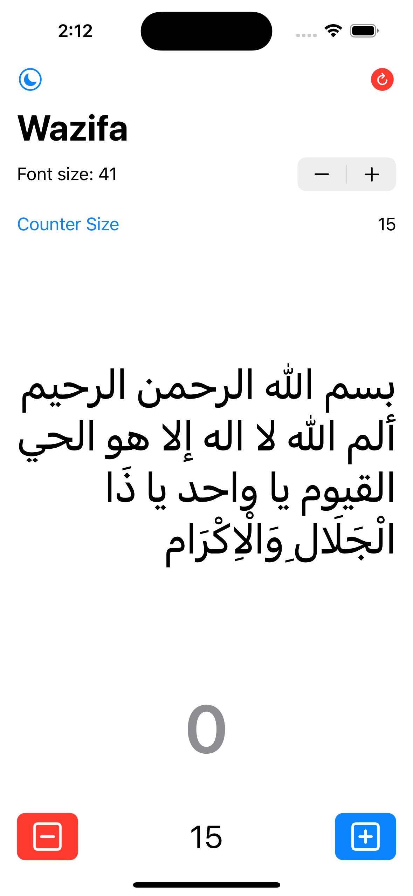
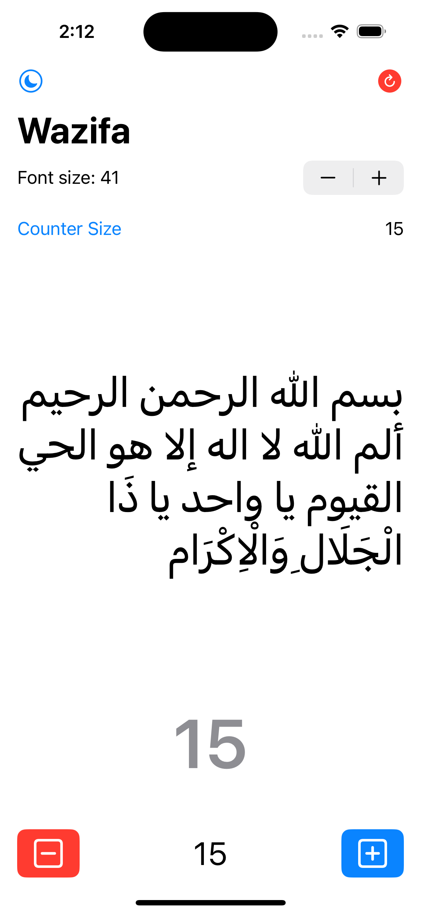
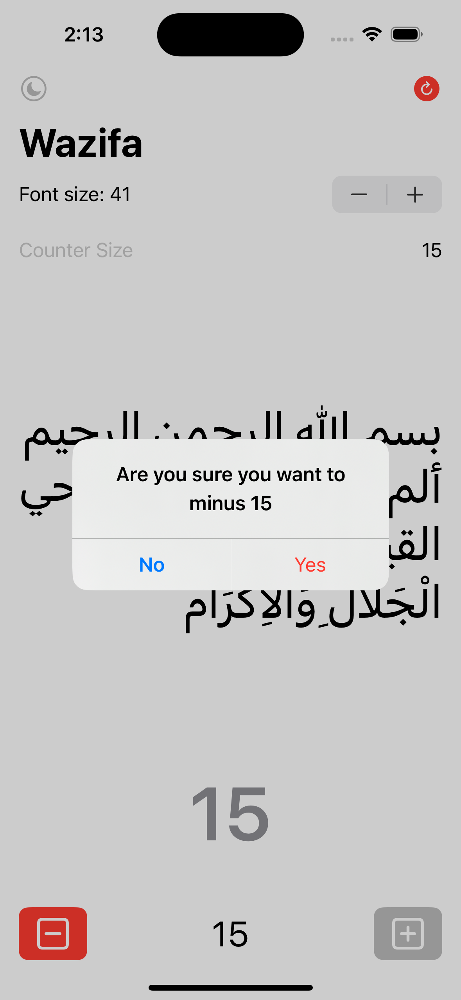
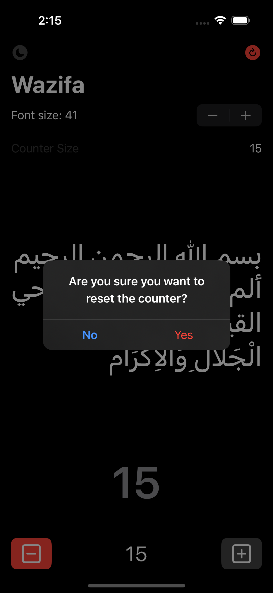
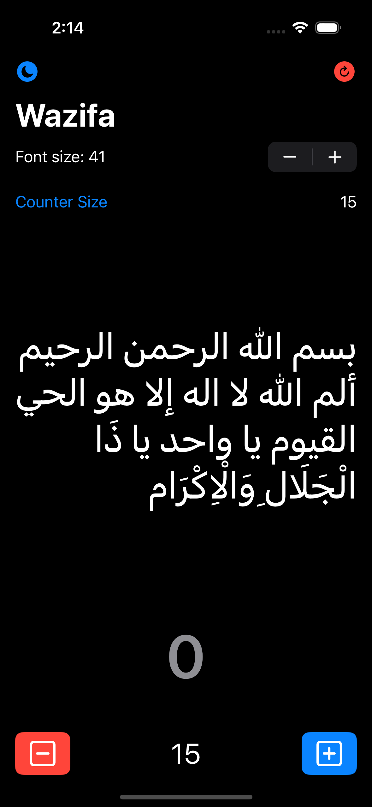
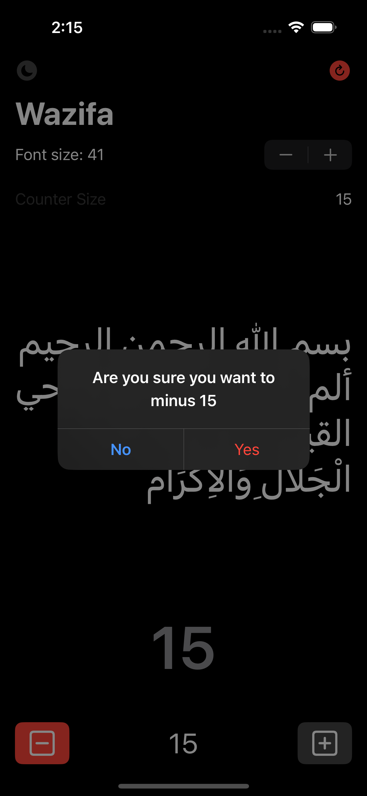

# Ism-e-Azam-Tasbeeh-Counter
Referece Video: https://youtu.be/9tNdMBUr07A?t=462

## Brief description of video;
بسم الله الرحمن الرحيم
 ألم الله لا اله إلا هو الحي القيوم يا واحد يا ذَا الْجَلَالِ وَالْاِکْرَام

Above written First Ayat of Surah Aal e Imran is combined with Ya Wahid, Ya Zal Jalal i Wal-Ikram contains Ism-e-Azam and whoever asks Allah with Ism-e-Azam his dua is accepted and fulfilled, a known Urdu scholar Hasham Ilahi Zaheer narrates that his grandfather (Hafiz Muhammad Gondalvi) says whoever reads this 313 times and then ask Allah for something, Allah will definitely bless him with his need but please do recite Durood Shareef before and after dua.

### Screenshots
#### Light Mode
<table>
  <tr>
    <td></td>
    <td></td>
    <td></td>
    <td></td>
  </tr>
</table>

#### Dark Mode
<table>
  <tr>
    <td></td>
    <td></td>
    <td></td>
    <td></td>
  </tr>
</table>
